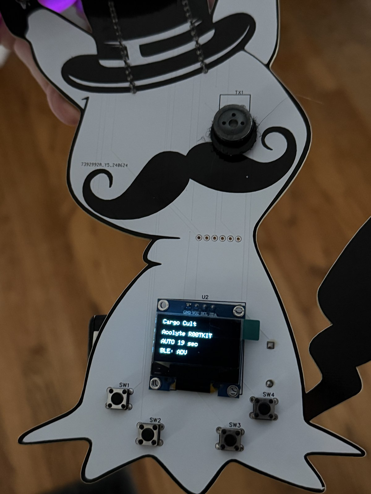

# Cargo Cult

Cargo Cult is a serial-first BLE role emulator for classic ESP32 boards. It uses
one legacy advertisement at a time and rotates static-random peer identities.

## Tested hardware

Cargo Cult has been tested on the [Society of Shenanigans DEF CON 32 DEFMON
badge](https://github.com/RCydefe/defmon/tree/main/defmon-release), using the
`defmon-wroom` profile and its OLED/button wiring.



## Build

Install [PlatformIO Core](https://docs.platformio.org/en/latest/core/installation/index.html), then run one of:

```powershell
py -m platformio run -e esp32dev
py -m platformio run -e defmon-wroom
```

Upload to the serial port assigned to your board:

```powershell
py -m platformio run -e esp32dev -t upload --upload-port <serial-port>
```

For the optional OLED/button hardware profile, use `defmon-wroom` in place of
`esp32dev`. Flashing replaces the board's current firmware, so make a backup
before uploading.

## Optional OLED/button wiring

- SSD1306 OLED: SDA **GPIO 21**, SCL **GPIO 22**, address `0x3C`.
- Next-phase button: **GPIO 26**, active low (internal pull-up enabled).
- Status LED: **GPIO 2**.

The generic `esp32dev` target needs no display, LED, or button. Hardware options
can be overridden with PlatformIO `build_flags` using the `CARGO_*` names in
`include/cargo_config.h`.

## Serial control

Connect at **115200** baud and send a line ending after one of:

```text
help
status
mode auto
mode manual
role acolyte
role glyph
role elder
role cthulhu
next
```

Automatic mode advances through Acolyte, Glyph, Elder, and Cthulhu at 60-second
intervals. `next` also works from the optional GPIO 26 button.

## Compatibility

Cargo Cult is a normal-role emulator for classic ESP32/WROOM hardware.
Acolyte, Glyph, Elder, and Cthulhu rotate with unique static-random identities.
For the validated ESP32-C3 companion implementation, use [Cargo Cult
Multi-Adv](https://github.com/ray-goldman/cargo-cult-multiadv).
